# 1 腾讯滑块

- **网址**：`aHR0cHM6Ly9jbG91ZC50ZW5jZW50LmNvbS9wcm9kdWN0L2NhcHRjaGE=`

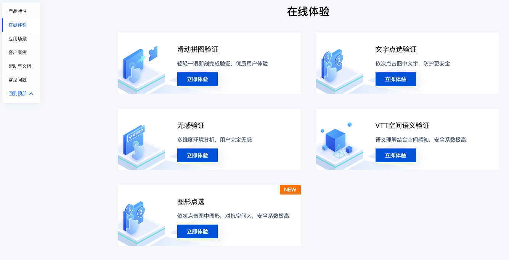

# 2 滑块问题思路分析

## 2.1 获取初始化接口

- 验证类型：**滑块**-`slide`，**点选**-`select`
- 验证图片信息：**图片链接**-`img_url`，**图片数据**-`img_base64`
- 唯一性参数：用于最终验证参数（哪一次的验证）

## 2.2 中间辅助接口

- 根据具体网站确定即可，可有可无

- 例如：极验3滑块，除了初始化接口，还要准备3个接口，缺一个就会验证失败

  ~~~python
  # 1、https://www.geetest.com/demo/gt/register-slide-official，获取gt，challenge
  gt, challenge = parse_register_slide_official_url()
  
  # 2、https://api.geetest.com/get.php，获取"c": [12, 58, 98, 36, 43, 95, 62, 15, 12],"s": "2e4f506e",
  parse_geetest_get_php_url(gt, challenge)
  
  # 3、"https://api.geevisit.com/ajax.php"，获取验证类型:slide
  parse_geevisit_ajax_php_url(gt, challenge)
  
  # 4、https://api.geevisit.com/get.php，获取滑块图片
  challenge, bg_url, slice_url, c, s = parse_geevisit_get_php(gt, challenge)
  # print(challenge, bg_url, slice_url, c, s)
  ~~~

## 2.3 滑块分析（两大参数）

- 滑动距离：缺口图片—>背景图片，**X轴**距离，有时会需要**Y轴**距离（图片左上角为坐标原点）

  ~~~python
  # 利用Python第三方库，如ddddocr、OpenCV计算
  # 利用打码平台计算
  ~~~

- 滑动轨迹

  ~~~python
  # 根据滑动距离，生成轨迹
  # 分析轨迹组成结构，利用Python实现，一般需要3个参数x、y、t，x是横坐标（增量），y是纵坐标（增量），t是时间（增量）
  # 滑块轨迹最终形成一个大的列表，对于不同网站，可能在轨迹的基础上，针对列表的每一项，再生成加密轨迹
  ~~~

## 2.4 最终校验

- 提交上述过程中，产生的全部参数，并提交最终滑块验证接口，完成滑块验证
- 验证成功后，返回一个验证成功参数

# 3 腾讯滑块分析

## 3.1 抓包（两个接口）

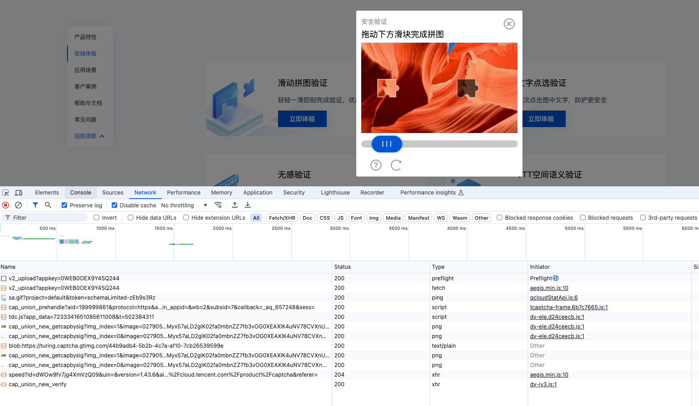

- `cap_union_prehandle`前置接口，获取验证图片，及其它相关参数
- `cap_union_new_verify滑块接口`，含有6个请求参数：
  - `collect`：加密值，待分析逆向
  - `tlg`：`collect`的长度
  - `eks`：加密值，待分析逆向
  - `sess`：`cap_union_prehandle前置接口`返回值
  - `ans`：`"[{\"elem_id\":1,\"type\":\"DynAnswerType_POS\",\"data\":\"403,82\"}]"`，其中`data`是滑块x，y坐标
  - `pow_answer`：加密值，待分析逆向
  - `pow_calc_time`：加密值，待分析逆向

## 3.2 `cap_union_prehandle`前置接口

- `cap_union_prehandle`前置接口，获取验证图片，及其它相关参数

  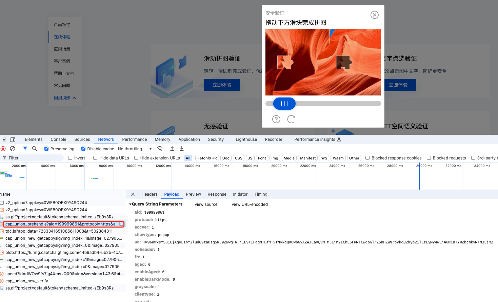

- 请求参数分析：

  ~~~python
  # 常规参数，均为网站参数，不同网站参数不同
  # ua为base64加密
  params = {
    "aid": "199680628",
  	"ua": "TW96aWxsYS81LjAgKE1hY2ludG9zaDsgSW50ZWwgTWFjIE9TIFg...",
    ...
  }
  ~~~

- 响应参数分析（先搁置，不用过分纠结，在逆向参数时回头再查看）：

  ~~~python
  _aq_657248({
      "sess": "s0I7K1lsYtUYe9Xx_QGX_YaiKKxNtUR-4Sdmsf6dgXOKhRVJ...", # 唯一性参数
      "data": {
          "comm_captcha_cfg": {
              "tdc_path": "/tdc.js?app_data=7233341651085611008&t=502384311", # 加密js文件
              "feedback_url": "https://support.qq.com/products/304457",
              "pow_cfg": {
                  "prefix": "e0441bc9adebdceb#", # 加密参数
                  "md5": "6033270119414d795f6d63bbd936b8cb" # 加密参数
              }
          },
          "dyn_show_info": {
              "lang": "zh-cn",
              "instruction": "拖动下方滑块完成拼图",
              "bg_elem_cfg": {
                  "sprite_pos": [0, 0],
                  "size_2d": [672, 480],
                  "img_url": "/cap_union_new_getcapbysig?img_index=1..." # 背景图片
              },
              "fg_elem_list": [{
              }, {
                  "id": 1,
                  "sprite_pos": [140, 490],
                  "size_2d": [120, 120],
                  "init_pos": [50, 82], # y坐标
                  "move_cfg": {
                      "track_limit": "x>=50&&x<=552",
                      "move_factor": [1, 0],
                      "data_type": ["DynAnswerType_POS"]
                  }
              }, {
              }],
              "fg_binding_list": [{
              }, {
              }],
              "sprite_url": "/cap_union_new_getcapbysig?img_index=0...", # 缺口图片
              "color_scheme": "#0057d4"
          }
      },
    ...
  })
  ~~~

## 3.3 `cap_union_new_verify`验证接口

- `cap_union_new_verify`验证接口

  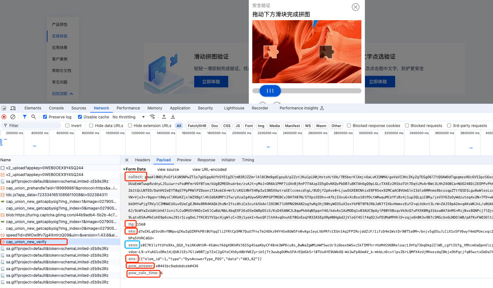

- 请求参数分析：

  ~~~python
  data = {
      "collect": "pmaAl9NDjPxGf14iN5NPwZT1o7gUSgq4UfhSYE1gZCtmB3RJ...", # 加密值
      "tlg": "1560", # collect长度
      "eks": "d7wIKLqO3vU8vYBNpvqIKwZqOZRPkPBl0UYqqIli2YRtCp5MK7...", # 加密值
      "sess": "s0I7K1lsYtUYe9Xx_QGX_YaiKKxNtUR-...", # cap_union_prehandle返回值
      "ans": "[{\"elem_id\":1,\"type\":\"DynAnswerType_POS\",\"data\":\"403,82\"}]", # 滑块x、y坐标
      "pow_answer": "e0441bc9adebdceb#436", # 加密值
      "pow_calc_time": "6" # 加密值
  }
  ~~~

- 响应参数：

  ~~~python
  {
      "errorCode": "0",
      "randstr": "@Gyt",
      "ticket": "tr034U97RoWHGMPnVh1xK8qDbdItvKZL22NeasRpLkD1vt6bKoNW_UI-...",
      "traceId": "",
      "errMessage": "",
      "sess": ""
  }
  ~~~

# 4 腾讯滑块验证步骤

## 4.1 总体流程

~~~python
def main():
    # 1、cap_union_prehandle前置请求接口
    prehandle_response = cap_union_prehandle()
    prehandle_json = json.loads(prehandle_response[1:-1])

    # 2、滑块分析
    # 2.1、背景图
    img_url = prehandle_json["data"]["dyn_show_info"]["bg_elem_cfg"]["img_url"]
    # sprite_url = prehandle_json["data"]["dyn_show_info"]["sprite_url"]
    parse_slide_url(img_url, 'x1-backgroud_img')
    # slide_img = parse_slide_url(sprite_url, 'x2-slide_img')
    # 2.2、滑块参数ans
    x = get_slide_x()
    y = prehandle_json["data"]["dyn_show_info"]["fg_elem_list"][1]["init_pos"][1]
    ans_json = [{"elem_id": 1, "type": "DynAnswerType_POS", "data": f"{x},{y}"}]
    ans = json.dumps(ans_json, separators=(',', ':'))
    print(ans)

    # 3、获取tdc.js文件
    tdc_path_url = prehandle_json["data"]["comm_captcha_cfg"]["tdc_path"]
    get_tdc_js_file(tdc_path_url)

    # 4、cap_union_new_verify滑块接口
    # 4.1、collect/tlg/eks参数
    collect, tlg, eks = get_verify_params()
    # 4.2、sess/pow_answer/pow_calc_time参数
    sess = prehandle_json['sess']
    pow_answer, pow_calc_time = get_pow_params(prehandle_json)
    # 4.3、请求cap_union_new_verify接口
    verify_response = cap_union_new_verify(
        collect, tlg, eks, sess, ans, pow_answer, pow_calc_time)
    print(verify_response)
    return

if __name__ == '__main__':
    main()
# https://cloud.tencent.com/product/captcha
~~~

## 4.2 `cap_union_prehandle`前置接口

- 在前置接口中，获取sess，用于下次请求

- 获取背景图、滑块图，用于滑动距离分析

  ~~~python
  def cap_union_prehandle():
      url = "https://turing.captcha.qcloud.com/cap_union_prehandle"
      headers = {...}
      params = {...}
      response = requests.get(url, headers=headers, params=params)
      return response.text
  
  # 1、cap_union_prehandle前置接口
  prehandle_response = cap_union_prehandle()
  prehandle_json = json.loads(prehandle_response[1:-1])
  ~~~

## 4.3 `cap_union_new_verify`各个参数分析

### 4.3.1 ★ `collect`、`tlg`、`eks`，核心逆向参数

- 直接通过关键字搜索`collect:`，找到加密位置，同时找到`eks`、`ans`

  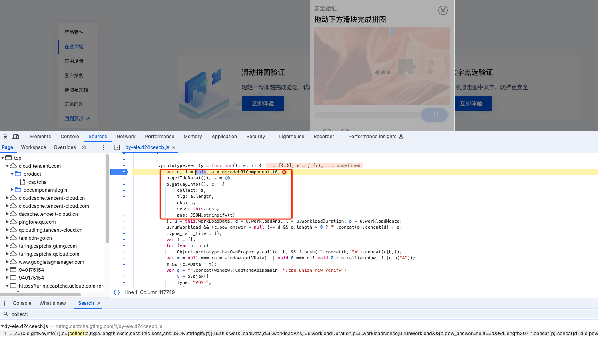

- `collect`实际等于`a`

  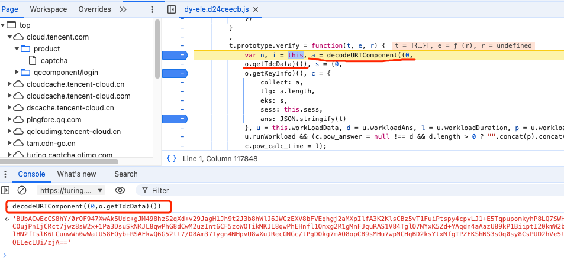

- 进入`o.getTdcData`，找到生成位置，`window.TDC.getData(!0)`

  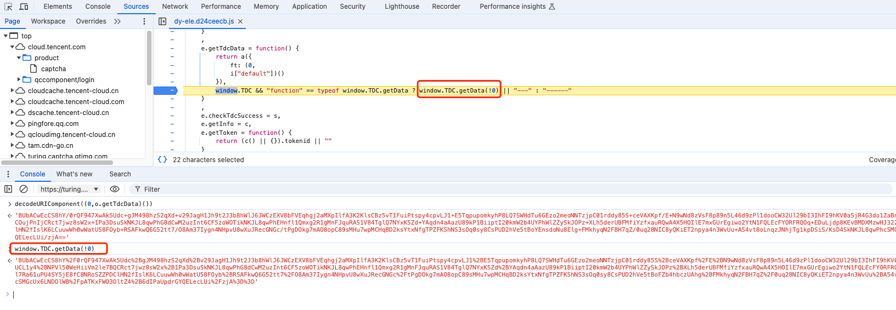

- 进入`window.TDC.getData`，发现是另一个js文件，由于是通过`window`调用函数生成，因此全扣，开始逆向分析

  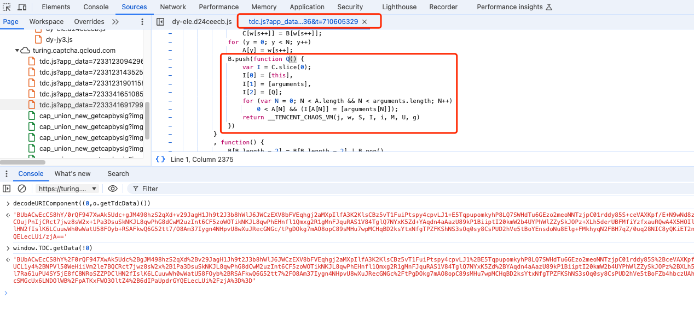

- 同理，`eks`与`collect`类似，构建生成函数

  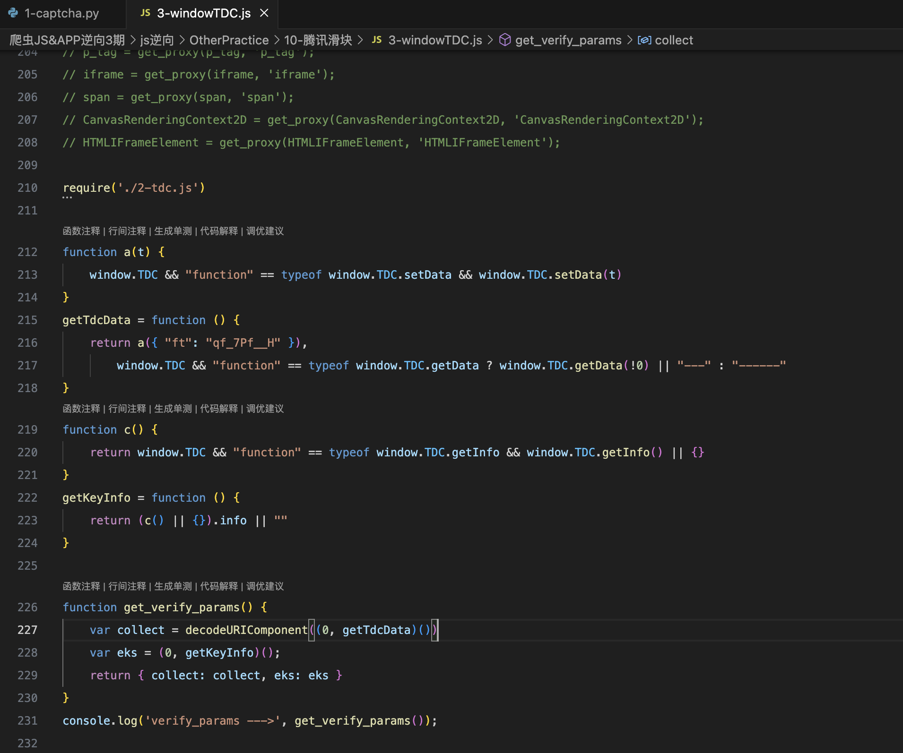

- ★在逆向分析时，需通过补环境实现

- `collect`、`tlg`、`eks`

  ~~~python
  def get_verify_params():
      with open('./3-windowTDC.js', 'r') as f:
          js_file = f.read()
      js_code = execjs.compile(js_file)
      verify_params = js_code.call('get_verify_params')
      collect = verify_params['collect']
      tlg = len(collect)
      eks = verify_params['eks']
      return collect, tlg, eks
  
  collect, tlg, eks = get_verify_params()
  ~~~

### 4.3.2 `ans`，滑块分析

- `ans`中，包含了滑块移动距离，即x坐标，y坐标，需根据背景图、缺口图分析

- 获取背景图、缺口图，并下载图片

  ~~~python
  def parse_slide_url(img_url, img_name):
      url = "https://turing.captcha.qcloud.com"
      headers = {...}
      response = requests.get(url+img_url, headers=headers)
      with open(f'{img_name}.jpg', 'wb') as f:
          print(f'{img_name}下载成功')
          f.write(response.content)
      return 
  
  img_url = prehandle_json["data"]["dyn_show_info"]["bg_elem_cfg"]["img_url"]
  # sprite_url = prehandle_json["data"]["dyn_show_info"]["sprite_url"]
  parse_slide_url(img_url, 'x1-backgroud_img')
  # slide_img = parse_slide_url(sprite_url, 'x2-slide_img')
  ~~~

- 背景图、缺口图

  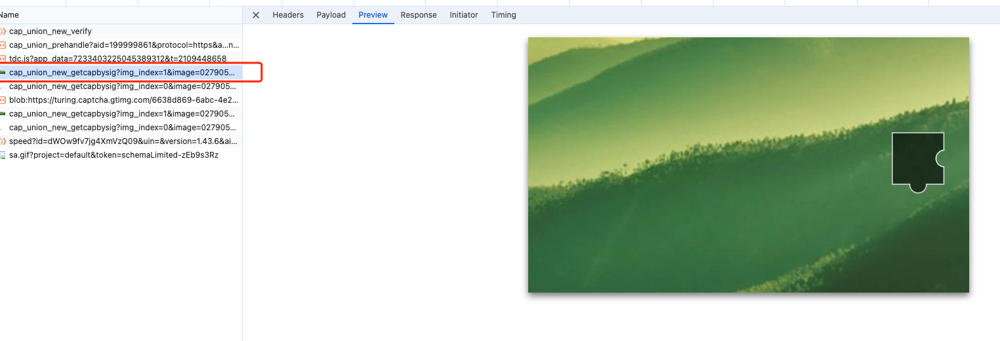

  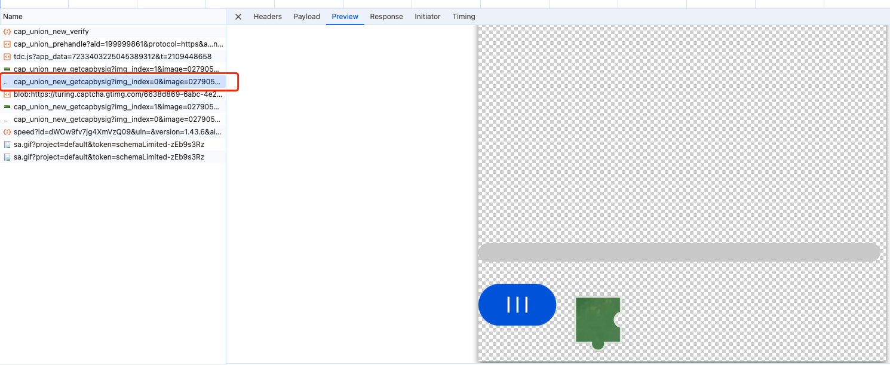

  - 这类**缺口图**，无法通过`ddddocr`、`OpenCV`处理，只能针对**背景图**，通过打码平台识别缺口`x`轴距离

  - 推荐一个打码平台：**得塔云**，网址`https://www.detayun.cn/tool/verifyCodeHomePage2/`，使用6号类型

    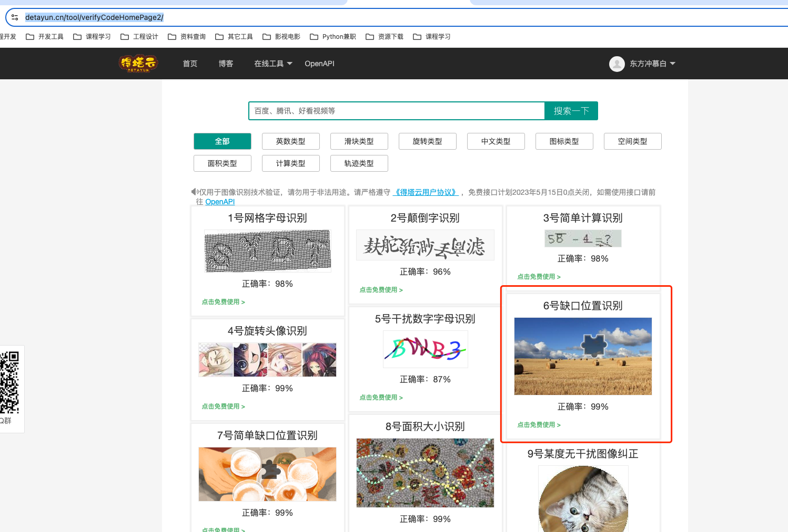

- `x`轴距离识别

  - 网页上`x`轴距离为：`235`

    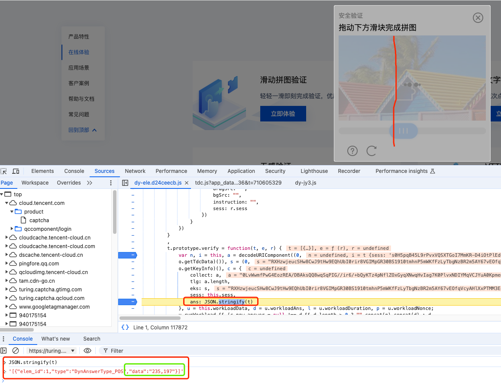

  - 打码平台识别`x`轴距离为：`257`

    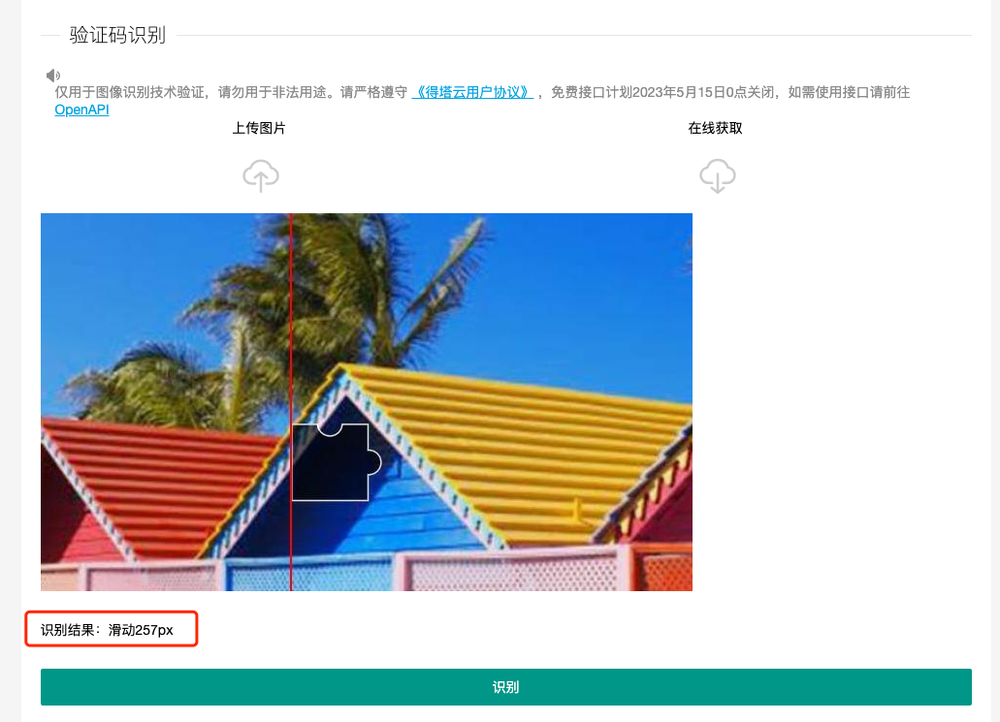

  - 二者相差约20

    ~~~python
    class DeTaYun:
        def __init__(self, key, verify_idf_id, img_path):
            self.key = key
            self.img_path = img_path
            self.verify_idf_id = verify_idf_id
    
        # PIL图片保存为base64编码
        def PIL_base64(self, img, coding='utf-8'):
            img_format = img.format
            if img_format == None:
                img_format = 'JPEG'
            format_str = 'JPEG'
            if 'png' == img_format.lower():
                format_str = 'PNG'
            if 'gif' == img_format.lower():
                format_str = 'gif'
            if img.mode == "P":
                img = img.convert('RGB')
            if img.mode == "RGBA":
                format_str = 'PNG'
                img_format = 'PNG'
            output_buffer = BytesIO()
            img.save(output_buffer, quality=100, format=format_str)
            byte_data = output_buffer.getvalue()
            base64_str = 'data:image/' + img_format.lower() + ';base64,' + \
                base64.b64encode(byte_data).decode(coding)
            return base64_str
    
        # 验证码识别接口
        def parse_verify(self):
            url = "http://www.detayun.cn/openapi/verify_code_identify/"
            header = {"Content-Type": "application/json"}
            data = {
                # 用户的key
                "key": self.key,
                # 验证码类型
                "verify_idf_id": self.verify_idf_id,
                # 样例图片
                "img_base64": self.PIL_base64(Image.open(self.img_path)),
            }
            # 发送请求调用接口
            response = requests.post(url=url, json=data, headers=header)
            # 获取响应数据，识别结果
            return response.text
    
    
    def get_slide_x():
        key = "个人账户平台参数"
        verify_idf_id = '6'
        img_path = './x1-backgroud_img.jpg'
        detayun = DeTaYun(key, verify_idf_id, img_path)
        distance = json.loads(detayun.parse_verify())['data']['distance']
        return distance-20
    
    x = get_slide_x()
    ~~~

- `y`轴距离

  - `y`轴距离与缺口位置有关，因此回到`cap_union_prehandle`前置接口响应中查看，发现有`y`轴距离

    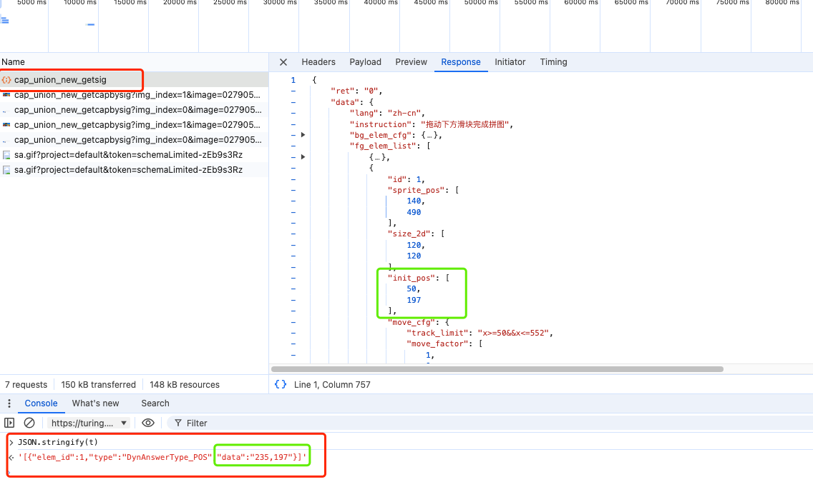

  - 直接获取`y`轴距离

    ~~~python
    y = prehandle_json["data"]["dyn_show_info"]["fg_elem_list"][1]["init_pos"][1]
    ~~~

- `ans`参数

  ~~~python
  ans_json = [{"elem_id": 1, "type": "DynAnswerType_POS", "data": f"{x},{y}"}]
  ans = json.dumps(ans_json, separators=(',', ':'))
  ~~~

### 4.3.3 `pow_answer`、`pow_calc_time` 

- 直接关键字搜索`pow_answer`、`pow_calc_time` 

  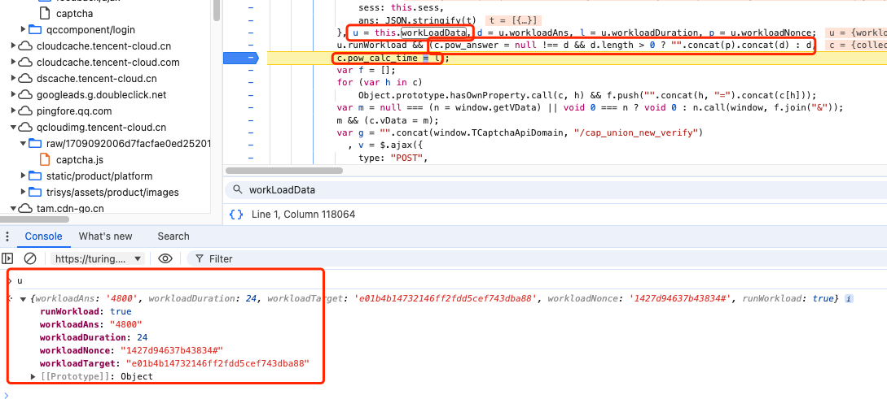

- 其中`p`，来自`cap_union_prehandle`前置接口响应参数

  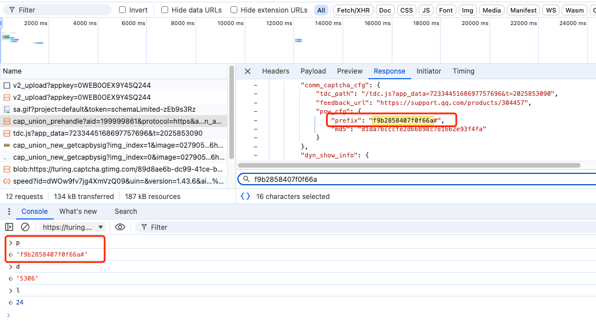

  ~~~python
  prefix = prehandle_json["data"]["comm_captcha_cfg"]["pow_cfg"]["prefix"]
  ~~~

- 发现`pow_answer=d`、`pow_calc_time=l`，`d`、`l`均来自`u = this.workLoadData`，再搜索

   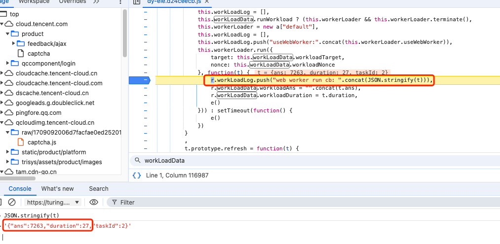

- 此时`t`已经完成计算，因此从外层函数开始扣代码

  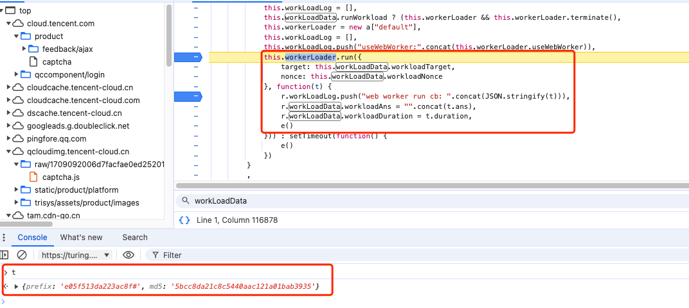

  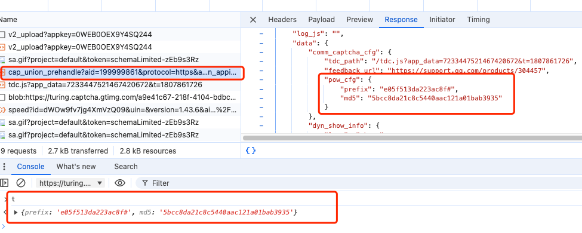

- 进入`this.workerLoader.run`，单步调试，不要太快，否则会直接越过`window.setTimeout`

  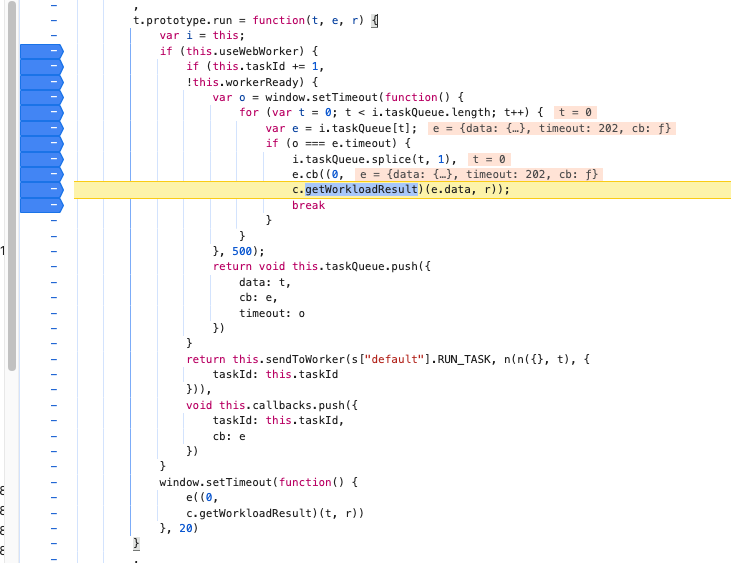

- 进入`c.getWorkloadResult`，开始扣代码

  

- 构建函数

  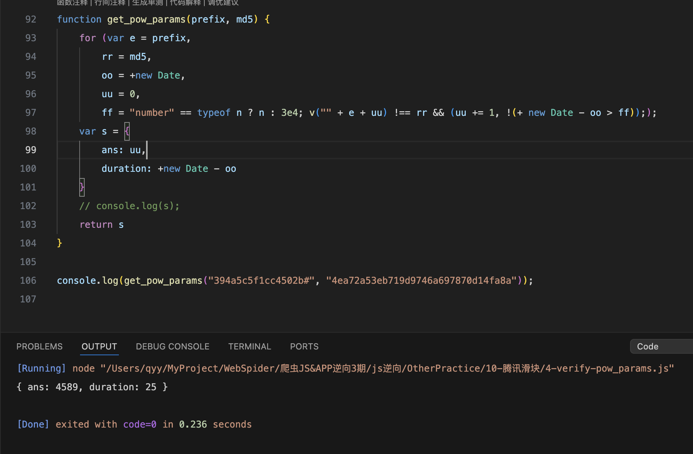

  ~~~python
  def get_pow_params(prehandle_json):
      prefix = prehandle_json["data"]["comm_captcha_cfg"]["pow_cfg"]["prefix"]
      md5 = prehandle_json["data"]["comm_captcha_cfg"]["pow_cfg"]["md5"]
      with open('./4-verify-pow_params.js', 'r') as f:
          js_file = f.read()
      js_code = execjs.compile(js_file)
      pow_params = js_code.call('get_pow_params', prefix, md5)
      pow_answer = prefix+str(pow_params['ans'])
      pow_calc_time = pow_params['duration']
      return pow_answer, pow_calc_time
  
  pow_answer, pow_calc_time = get_pow_params(prehandle_json)
  ~~~

## 4.4 最终提交验证

~~~python
def cap_union_new_verify(collect, tlg, eks, sess, ans, pow_answer, pow_calc_time):
    url = "https://turing.captcha.qcloud.com/cap_union_new_verify"
    headers = {...}
    data = {
        "collect": collect,
        "tlg": tlg,
        "eks": eks,
        "sess": sess,
        "ans": ans,
        "pow_answer": pow_answer,
        "pow_calc_time": pow_calc_time
    }
    response = requests.post(url, headers=headers, data=data)
    return response.text

verify_response = cap_union_new_verify(collect, tlg, eks, sess, ans, pow_answer, pow_calc_time)
print(verify_response)
~~~

# 5 `TDC.js`文件

- 在逆向`collect`、`tlg`、`eks`参数时，解密时导入了`TDC.js`文件

- `TDC.js`文件是通过`cap_union_prehandle`前置接口返回的，因此需更新

- `TDC.js`文件保存在本地后，通过导入使用，**注意**：`TDC.js`文件**不能格式化**

  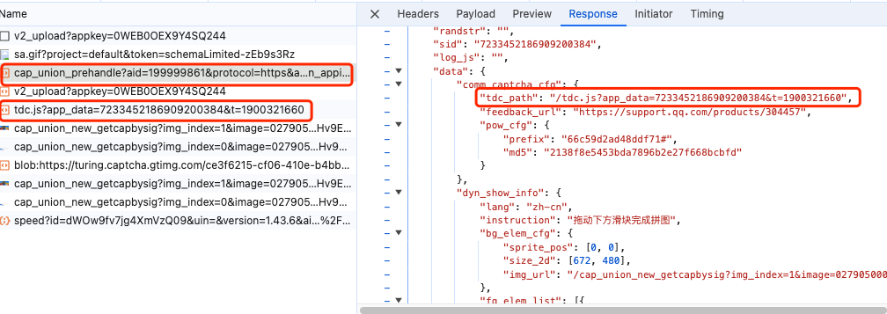

  ~~~python
  def get_tdc_js_file(tdc_path_url):
      # tdc_path_url=/tdc.js?app_data=7163914470737158144&t=1652048263
      # https://turing.captcha.qcloud.com/tdc.js?app_data=7163913217567203328&t=295620219
      url = "https://turing.captcha.qcloud.com"
      headers = {...}
      response = requests.get(url+tdc_path_url, headers=headers)
      with open('2-tdc.js', 'w') as f:
          f.write(response.text)
  
  # 获取tdc.js文件
  tdc_path_url = prehandle_json["data"]["comm_captcha_cfg"]["tdc_path"]
  get_tdc_js_file(tdc_path_url)
  ~~~

